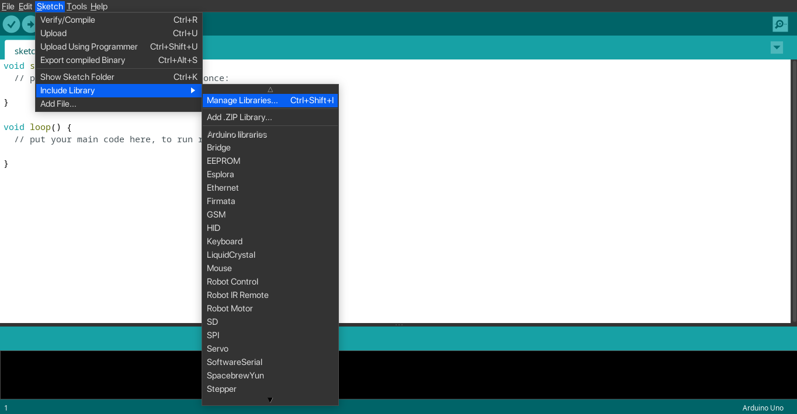
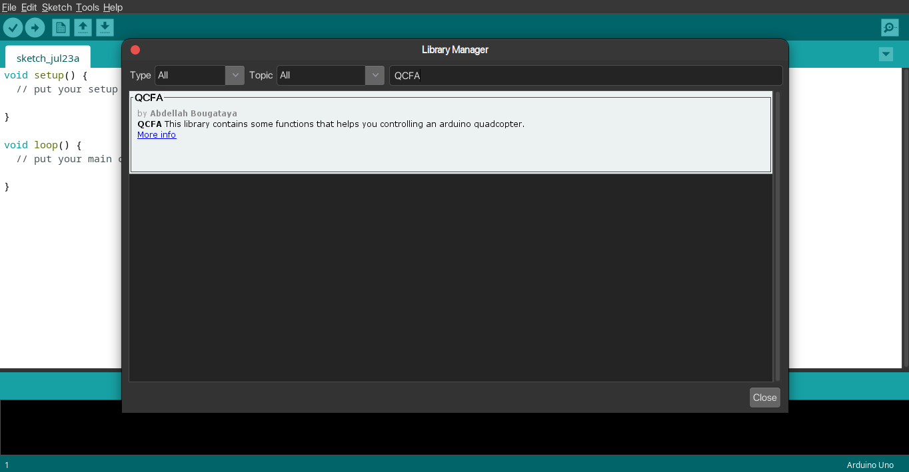
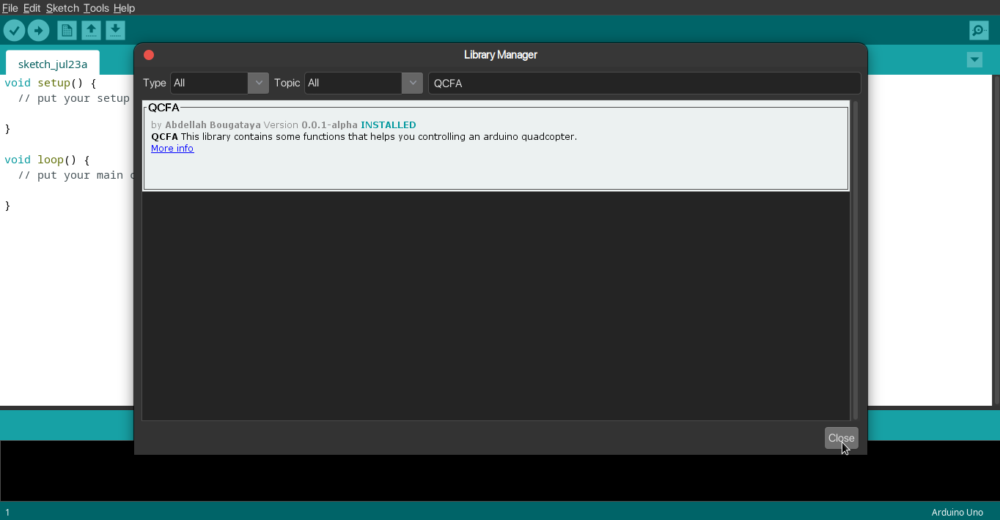

<div align='center'></div>

[](https://github.com/AbdoullahBougataya/QCFA/issues?q=is%3Aopen)[](https://github.com/AbdoullahBougataya/QCFA/commits/main)[](https://github.com/AbdoullahBougataya/QCFA/blob/main/LICENSE)[](#)[](https://store.arduino.cc/products/arduino-uno-rev3)[](https://github.com/AbdoullahBougataya/QCFA/actions/workflows/check-arduino.yml)

<div align='center'>🕹️ <strong>Q</strong>uadcopter <strong>C</strong>ontrol <strong>F</strong>unctions using <strong>A</strong>rduino Uno 🕹️</div>

---

# How to use it ?

## Installation 💾

### Arduino Libraries manager

Here is a step by step guide to install QCFA from the Arduino Libraries manager:

- **Step 1**: Open the Arduino IDE and click to the "Sketch" menu and then *Include Library > Manage Libraries*:

  

- **Step 2**: Click in the search bar at the top:


- **Step 3**: write down "QCFA":

  

- **Step 4**: click install on the first result:

  

- **Step 5**: then press "Close":

  

### Manually

#### Windows

Open the terminal then run: (*Please skip this command if you have already installed the Servo library*)

```powershell
git clone https://github.com/arduino-libraries/Servo.git %USERPROFILE%/Documents/Arduino/libraries/Servo
```

then run:

```powershell
git clone https://github.com/AbdoullahBougataya/QCFA.git %USERPROFILE%/Documents/Arduino/libraries/QCFA
```

#### Mac or Linux

Open the terminal then run: (*Please skip this command if you have already installed the Servo library*)

```bash
git clone https://github.com/arduino-libraries/Servo.git ~/Documents/Arduino/libraries/Servo
```

then run:

```bash
git clone https://github.com/AbdoullahBougataya/QCFA.git ~/Documents/Arduino/libraries/QCFA
```

# Use cases

First set the ESCs to the Arduino UNO pins 3, 5, 6 and 9 as shown in the image below:


Create this `demo.ino` file:

```c++
#include <Arduino.h>

#include <Servo.h>

#include <QCFA.h>

struct Quadcopter drone; /*get the drone parameters from the quadcopter structure*/

void setup()
{
  int motor1_esc_pin = 6;
  int motor2_esc_pin = 10;
  int motor3_esc_pin = 9;
  int motor4_esc_pin = 11;
  drone.mass = 0.3525;  /*variable of the total mass of the quadcopter in (Kg) */
  drone.propellers_radius = 0.038; /*variable of the propeller radius in (m) */
  drone.voltage = 22.8; /*variable of the battery voltage in (v) */
  drone.KVs = 2450;     /*variable of the KVs of the motor in (KV) */
  /* The pulse width attached to pins 6, 9, 10 and 11
   have a minimum of 1000 µs and maximum of 2000 µs */
  drone.ESC1.attach(motor1_esc_pin, 1000, 2000);
  drone.ESC2.attach(motor2_esc_pin, 1000, 2000);
  drone.ESC3.attach(motor3_esc_pin, 1000, 2000);
  drone.ESC4.attach(motor4_esc_pin, 1000, 2000);
  bool calibrated = false; /* Set calibrated to false if it's the first time */
  if (calibrated == false)
  {
    calibrate(drone, 20000); /*20 s is the time taken by the ESC to make that beep so this calibration process will take 40s (it may vary depending on the ESCs used)*/
  }
}

void loop()
{
  stop(drone);                /*stop(Quadcopter parameter) stop all the motors*/
  exit(0);                    /*exit from the loop*/
}
```

Change `drone.mass`, `drone.propellers_radius`, `drone.voltage`,  `drone.KVs` and `calibrated` to their given value:

>`drone.mass`: the total mass of the drone in (Kg).
>
>`drone.propellers_radius`: the radius of the propellers in (m).
>
>`drone.voltage`: the battery voltage in (v).
>
>`drone.KVs`: the motor's flow factor in (KV).
>
>`calibrated`: `true `if the ESCs are already calibrated to 1 ms pulse width.

Then Build the file to the Arduino UNO. If everything is setup correctly, the motor will start beeping several times (This is called the ESC calibration), it might take about 40 seconds then the program will stop running. If an error occurs please open an issue, I will do my best to help you with your problem. 
